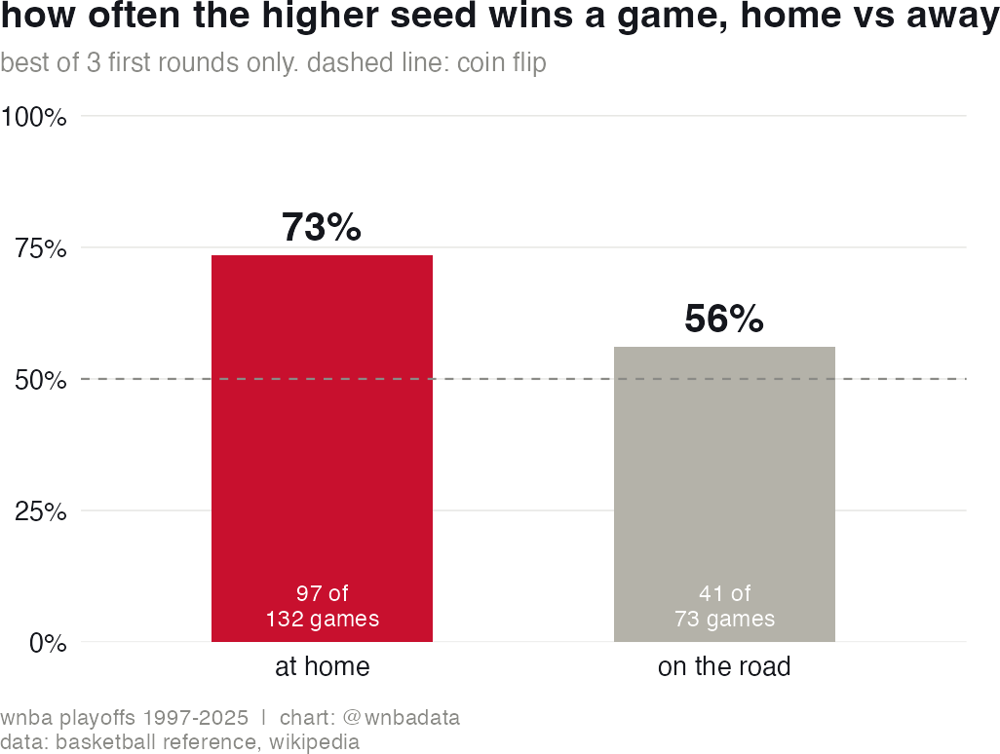
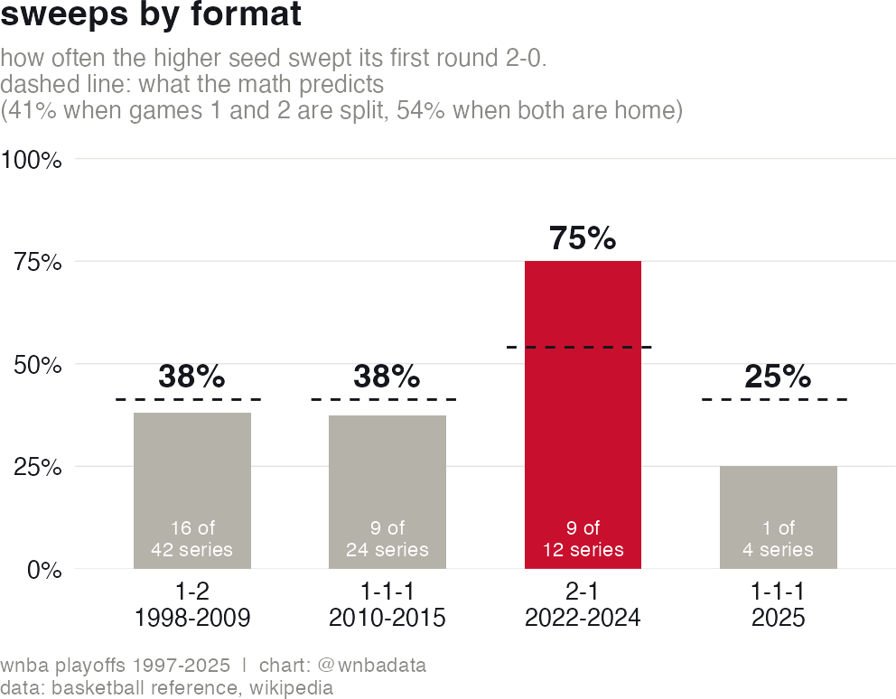
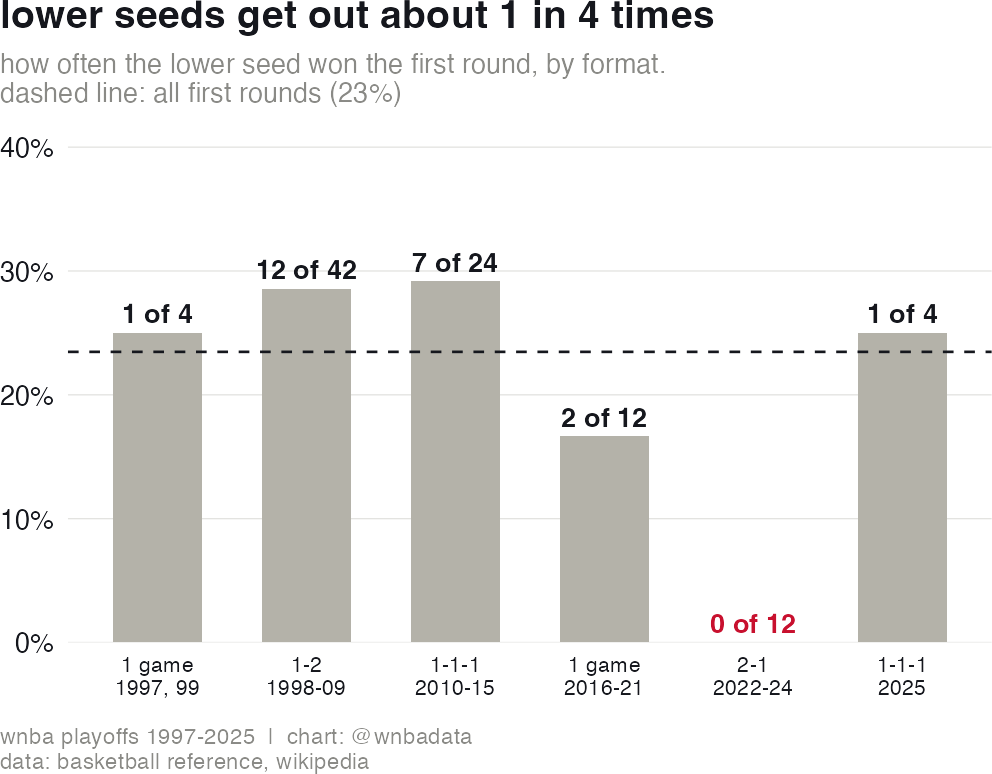

# How much does WNBA playoff seeding matter?

**Every WNBA first round, 1997-2025. The higher seed wins 73% of its home games and 56%
of its road games, so what a better seed really buys you is one extra home game. Moving
that home game around, as the league did in 2025, changes how many game 3s we get more
than it changes who advances.**

Video explainer: [@wnbadata](https://www.instagram.com/p/Ddm0G03voPP/).



## The question

The WNBA changed its first round format in 2025. From 2022 to 2024 the higher seed hosted
games 1 and 2 of the best of 3 and the lower seed hosted game 3 (2-1). Since 2025 the
lower seed hosts game 2 instead (1-1-1), so the higher seed's two home games are split
around a road trip.

Higher seeds went 12-0 in the first round under the old format, and the very first year of
the new one produced an upset, so the format change looked like it mattered. This asks
whether it did: how much is a better seed worth, and what actually changed when the home
games moved?

## The data

Every WNBA playoff series and game from 1997 through 2025, scraped from the
[Basketball Reference](https://www.basketball-reference.com/wnba/) season pages: 193
series and 505 games. Basketball Reference marks the home team with "@" in each game line,
which is where the home and road splits come from.

Seeds come from the **Wikipedia playoff bracket templates**, not from Basketball
Reference's standings order, which sorts cross conference ties wrong. In 2016 it lists
Atlanta ahead of Indiana, while the actual seeds were Indiana 5, Atlanta 6.

Section 1 of the script rebuilds all three CSVs in `data/` from those two sources. It only
runs when the CSVs are missing.

Scope, which matters a lot here:

- **First round only**, meaning each season's opening round: the 1998 semifinals (only four
  teams made the playoffs), the conference semifinals from 2000 to 2015, and the first
  round from 2022 to 2025. That is 82 best of 3 series.
- 1997, 1999 and 2016-2021 opened with **single elimination** games. They are in the upset
  rate and left out of anything that needs three games.
- A series only counts when the two seeds are comparable. Before 2016 seeds were given
  within each conference, so an "E2 vs W1" Finals is not a seeding question and is excluded.

## The method

Mostly counting, but counting carefully. Every game line on Basketball Reference says who
was at home, so each first round game is labelled by whether the higher seed was hosting,
and each series by which format it was played under. That gives the two numbers everything
else rests on: how often the higher seed wins at home, and how often it wins on the road.

The formats are then compared on three things: how often the higher seed won the series,
how often it swept, and how often the series reached a game 3.

Sweeps are where the order shows up most directly. Under 2-1 a sweep meant winning two
home games. Under 1-1-1 it means winning a home game and a road game, and the higher seed
is much weaker on the road, so sweeps should be rarer and game 3s more common.

Judgment calls: ties in the regular season standings share the better rank, so "top four
record" is generous rather than strict. Seeds are read from the bracket rather than
recomputed from records, which matters in the seasons where a tiebreaker decided the order.

## The finding

**The higher seed wins 73.5% of its first round home games (97 of 132) and 56.2% of its
road games (41 of 73).** On the road it is barely better than a coin flip, so nearly the
whole seeding advantage is the extra home game.

**Across every best of 3 first round, the higher seed has won 62 of 82 series (76%), and
that holds up across formats:** 71% under 1-2, 71% under the 2010-2015 version of 1-1-1,
12 for 12 under 2-1, and 3 of 4 in 2025. The 2-1 run is the eye catching one, but it is
only 12 series, and those were also the matchups with the biggest record gaps.

**What clearly did change is how long the series take.** Under 2-1 the higher seed swept
9 of 12 first rounds. Under 1-1-1 it swept 9 of 24 in 2010-2015 and 1 of 4 in 2025. Three
of the four first rounds went to a game 3 last year, as many as 2022, 2023 and 2024
combined.



**Lower seeds get out of the first round about 1 in 4 times (23 of 98), in almost every
format the league has used.** The exception is 2022-2024, when they went 0 for 12, and those
were also the 1 vs 8 and 2 vs 7 style matchups.



**And seeding is not destiny.** The 2021 Chicago Sky were the 6 seed at 16-16, won a single
elimination game in Minnesota, beat the 26-6 Connecticut Sun 3-1, and won the title. Every
other champion in league history had a top four regular season record.

## Caveats

- **Travel, rest and momentum are not controlled for.** 1-1-1 adds a trip before game 3,
  and with 82 series there is no way to detect an effect that size either way.
- **The format eras are not clean experiments.** From 2022 the first round is seeded 1 vs 8
  league wide, while 1999-2015 was 1 vs 4 and 2 vs 3 inside a conference. Some of the 2-1
  era's sweeps are bigger talent gaps rather than the home game order.
- **The samples are small.** 12 series under 2-1 and 4 under the 2025 format. Differences
  between formats here are well inside what luck produces, which is the point rather than a
  hedge: the series win rates all sit near the same 76%.
- **2020 was played at a neutral site**, so its "home" games are nominal. It had no best of 3
  rounds, so the home and road splits are unaffected.
- **Nothing here says why the league changed the format.** The change does guarantee every
  first round team a home game, which 9 lower seeds did not get from 2022 to 2024, but no
  stated reason is in this data.

## Run it

```r
source("playoff-seeding.R")
```

Requires: `rvest`, `dplyr`, `tidyr`, `purrr`, `stringr`, `ggplot2`, `gt`.

The script reads the CSVs in `data/`. Delete that folder to rebuild everything from
Basketball Reference and Wikipedia, which takes a few minutes of rate limited requests.

## Files

| File | What it is |
|---|---|
| `playoff-seeding.R` | scraper, analysis, charts and tables |
| `data/playoff_series.csv` | 193 series: seeds, records, results, format, whether it was an opening round |
| `data/playoff_games.csv` | 505 games: score, home team, whether the home team was the higher seed |
| `data/standings.csv` | regular season records, used for the champions chart |
| `figures/` | the charts |

## A note on how this was made

I worked on this with [Claude Code](https://claude.com/claude-code). I picked the question
and the framing, decided which findings were solid enough to publish, and wrote the video
around them. Claude wrote a lot of the scraping and plotting code, and I leaned on it to
check every claim against the data, which is how the seed sourcing bug and the difference
between first round and all-rounds numbers got caught. The numbers in this README are all
reproducible from the script above.
